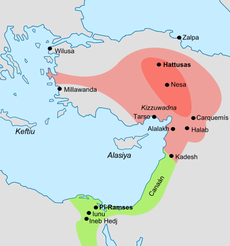

<small>This was written as the final paper to LING 199 - Introduction to Hittite taken at UIUC in the Spring semester of 2023, taught by Professor Shosted, and was adapted from the original [PDF version](report.pdf). 

:camera: Image credit: [AmusingPlanet](https://www.amusingplanet.com/2022/03/treaty-of-kadesh-worlds-first-peace.html): A relief of Ramses II in the Battle of Kadesh, Temple of Abu Simbel

</small>

## Introduction

Far from being independent states insulated from each other, the Mediterranean, Anatolian, and Mesopotamian regions in the Middle and Late Bronze age (c. 1500- 1100 BCE) saw empires constantly struggling for control and power in the region. It is within this intertwined backdrop that we start to see the bud of diplomacy between nations emerge that would eventually morph into the modern formal diplomatic mechanisms present today. We will investigate what is often lauded as the first treaty of its kind - the Treaty of Kadesh (also called Qadesh) between Ramses II of Egypt and Hattusili III of Hattusa. While it is not necessarily the first of its kind [1] and not without contemporaries [2], it is by far the most widely-acknowledged of the Late Bronze Age treaties, as well as being important in its historical placement, with respect to the domestic and diplomatic conditions of both participating parties at the time. In Section 2, we will try to place the treaty in context by describing the actors and prior events that happened leading up to the signing of the event. In Section 3, we will examine the contents of the treaty and picking out some linguistic quirks that surfaced in such early attempts for cross-cultural contact. Finally, the effects of the treaty both immediately after the signing and thousands of years to the modern age along with a brief conclusion will be given in Section 4.

## Historical Background

<small>
A map showing Hittite and Egyptian territories at the time of the Battle of Kadesh. Source: Wikipedia. By Crates, CC BY-SA 3.0, https://commons.wikimedia.org/w/index.php?curid=3546044
</small>
### The Late Bronze Age

As the dust of war settled in the Near East during the Late Bronze Age, structure had slowly risen out of the repeated conflicts: now, four empires dominated the area, addressing each other as brothers. To the south, the Egyptians reigned, the senior of this ”Royal Club” along with the Assyrians and Babylonians in Mesopotamia and the Hittites in Anatolia. They recognised that in order to keep their rule and influence, it was not only advantageous but necessary to form pacts and alliances with the other powers in the region. A selection of treaties and court correspondences between the Hittite empire and other political entities can be found in [2]. This treaty was notable in that it was not between an Empire and a vassal city-state, but between two *equal* Great Kings.

### Hittites

Internally, the Hittites were facing a multitude of problems, including revolts and succession problems. In particular, the ruler Hattusili III was an usurper: the brother of previous king Muwattalli, Hattusili seized power after his death after a power struggle with Muwattalli’s son, Urhi-Teshub. Ultimately, Urhi-Teshub was exiled, and eventually found his way to Egypt to the court of Ramses. This was bad news to Hattusili, as he badly needed to reinforce his position within Hattusa: if Ramses, being the senior member of the ”Royal Club,” was to support Urhi-Teshub as the rightful ruler of Anatolia, internal and external powers would jump at the chance to destabilise and carve up his rule, and by extension, the Hittite Empire. Indeed, letters were exchanged between the Hittite and Egyptian courts asking for the extradition of Urhi-Teshub from Pi-Ramesse, but at that point, Urhi-Teshub had apparently already fled Egypt [3].

Hittite-Egyptian relations had also soured following decades of war near the border, where Hittite and Egyptian expansion had brought the two empires into contact near modern Syria. Bloody wars had been fought over the control of these swinging cities such as Kadesh and Amurru. Previous rulers on either sides (Tutankhamun, Seti I , and Ramses II on the Egyptian camp; Suppiluliuma and Muwattalli on the Hittite) had fought each other to a bloody stalemate over control of the area, and neither were willing to continue the conflict, which drained resources due to long-distance military logistics.

Finally, concerns over Assyrian hostility were mounting: as the newcomer to the club, they came to power after the fall of the Mitannis and rapidly expanded - if unchecked, their westerward expansion would rapidly lead them to Hattusili’s door. To prevent an Assyrian takeover, the Hittites needed to ease tensions on the southern front and focus on their eastern border.

### Egypt

The Egyptians, led by Ramses II, had been fought to a stalemate after the battle of Kadesh against Suppiluliuma - where a military victory couldn't be achieved, Ramses would opt for a diplomatic one instead. After the campaign, Ramses focused on nation-building, and put his focus on building tombs and memorials, such as the temple of Abu Simbel (where a relief of the battle of Kadesh is carved on the temple walls, depicting a decisive Egyptian victory), in addition to expanding his new capital, Pi-Ramesse. He also turned his military attention south, towards the Nubian border, and campaigned south.
		
The same Assyrian concern shared by the Hittites may have also been a factor in Ramses' signing of the treaty, but in any case, Ramses was not interested in expanding further north, and would've preferred a stable northern border. 
		
## The Eternal Treaty
	
In this section, we delve into the treaty more deeply, analysing the archaelogical and linguistic evidence in addition to the actual contents of the treaty to piece together the political and historical story of the time.

### The archaeological evidence

Copies of treaty were found both in Egypt and Anatolia: the former being carved on walls in Thebes and the Temple of Karnak; the latter in the Hittite troves, preserved in clay tablets. We will follow the conventions of [4] and refer to the former as the *Egyptian* version (as it was written in Egyptian hieroglyphs) and the latter the *Hittite* (called *Hittite-Babylonian* in [4]) version (written in Akkadian, the *lingua franca* of its time). The texts mostly mirror each other, though they contain some differences, such as each of the tablets being written from the standpoint of the respective rulers, wording, and some clauses.

However, the current texts we have seem to be copies of an official ”silver tablet” that was sent between the two nations, as was attested in the preamble of the Egyptian text: “... made upon a tablet of silver for Usima’rē’setpenrē ...”. From the linguistic differences of the texts, we may piece together the history and circumstances of the treaty. For example, we learn from this text and others [2] that the *lingua franca* of the region was Akkadian, and not the native Hittite. In addition, we learn that the two versions of the treaty were most likely composed within their own countries, translated, and then sent to the other party through an envoy. This is made evident by a number of ”Egyptianisms” in the Hittite version and vice versa (”Hittitisms” in the Egyptian). An example given by Langdon and Gardner in [4] is the phrase ”good peace and good brotherhood,” which isn’t usually found in hieroglyphic writings and is most likely a translation from the original Babylonian. Langdon and Gardner briefly discuss the route and personnel that may have escorted the treaty between the empires in [4]; a more in-depth discussion on this topic can be found in [5].
### The content of the treaty

<small>
The treaty of Kadesh written in clay. By Osama Shukir Muhammed Amin FRCP(Glasg) - Own work, CC BY-SA 4.0, https://commons.wikimedia.org/w/index.php?curid=92827340
</small>
			
#### Treaty clauses
The content of the treaty were consistent with many other treaties that were drawn up at the time, and included terms including (but not limited to) mutual extradition agreements (perhaps aimed at Urhi-Teshub?), a defensive (military) alliance, succession rules (Hattusili, being an ursurper, must’ve been acutely aware of the dangers of being in power), and more. The clauses were backed up by the gods, and there is
a clause (clause 15 in [4]) dedicated to the gods as witnesses to the treaty; divine punishments were also to be incurred on whoever breached the agreements, outlined in the following section (Egyptian version, translation by [4]):

> ... as to him who shall not keep them, a thousand gods of the land of Hatti and a thousand gods of the land of Egypt shall destroy his house, his land and his servants...

 (Note the distinctly Hittite phrase ”thousand gods.” [6])

#### Linguistic analysis

While formulaic, the headers, titles, and other texts of the treaty reveal a lot about the translation conventions between the two empires, upon closer inspection and comparison between the two versions. For example, the Storm God Tesub and the Sun God are converted to their Egyptian equivalents: Sētekh and Prē’. Perhaps this may be intepreted as a Bronze Age belief that the gods were all worshipped, but under different names - in fact, in the tablets, neither Sētekh nor Prē’ are one god, but are associated with place names, for example, Sētekh of Hatti or Zippalanda.

Furthermore, we observe two things about the language that is used in the two treaties. First, that the treaties are written in first person, with the Egyptian version being as if Hattusili is speaking, and the Hittite version written from the first person standpoint of Ramses, as if orders were being given. The second being the way that the kings refer to each other - as brothers. The two observations both support the idea that they are both powerful, but more importantly, *equal* rulers of other realms. However, in the Egyptian version, a different determinative is used for Ramses (the one meaning great ruler) and Hattusili (meaning great chief), perhaps evidence that the Egyptians assumed seniority in the ”Royal Club.”

## Conclusion
Serving as a document to end hostilities between Hattusa and Pi-Ramesse, there is evidence that Hittite-Egyptian relations improved following this treaty [7], and that peace between the two empires continued until the end of the Hittite empire [3]. Through the carvings at Karnak and the clay tablets in Hattusa, we are able to see the world as it was seen by the ruling elites more than three thousand years ago - pioneers of the modern global age and the first actors on the international stage.

We see that the problems and strategies that the rulers of old faced three millenia ago are not so different from the ones being faced by world leaders now, and even the United Nations has a copy of the Akkadian version on display in their headquarters in New York - a symbol of peace, resonating throughout the ages. It serves as a reminder that we are able to overcome our animalistic, violent roots, and come to a compromise as humans, capable of communication, empathy, and kindness.
	
## References 

1. D. Sürenhagen, “Forerunners of the hattusili-ramesses treaty,” *BMSAES*, vol. 6, no. 1, pp. 59–67, 2006. (ref1)
2. G. M. Beckman and H. A. Hoffner, *Hittite Diplomatic Texts*. Scholars Press, 1996.
3. T. Bryce, “The ‘eternal treaty’ from the hittite perspective,” *BMSAES*, vol. 6, no. 1, pp. 1–11, 2006.
4. S. Langdon and A. H. Gardiner, “The treaty of alliance between Ḫattušili, king of the hittites, and the pharaoh ramesses ii of egypt,” *The Journal of Egyptian Archaeology*, vol. 6, no. 1, pp. 179–205, 1920.
5. K. Kitchen, “High society and lower ranks in ramesside egypt at home and abroad,” *BMSAES*, vol. 6, no. 1, pp. 31–36, 2006.
6. G. Beckman, “Hittite literature,” *From an Antique Land: An Introduction to Ancient Near Eastern Literature*, pp. 215–54, 2009.
7. Z. Guo, “How well did the “eternal treaty”function? an appraisal by the correspondence between hattusili iii and ramesses ii,” *Digital Archive of Brief notes & Iran Review*, vol. 9, pp. 35–46, 2022.
