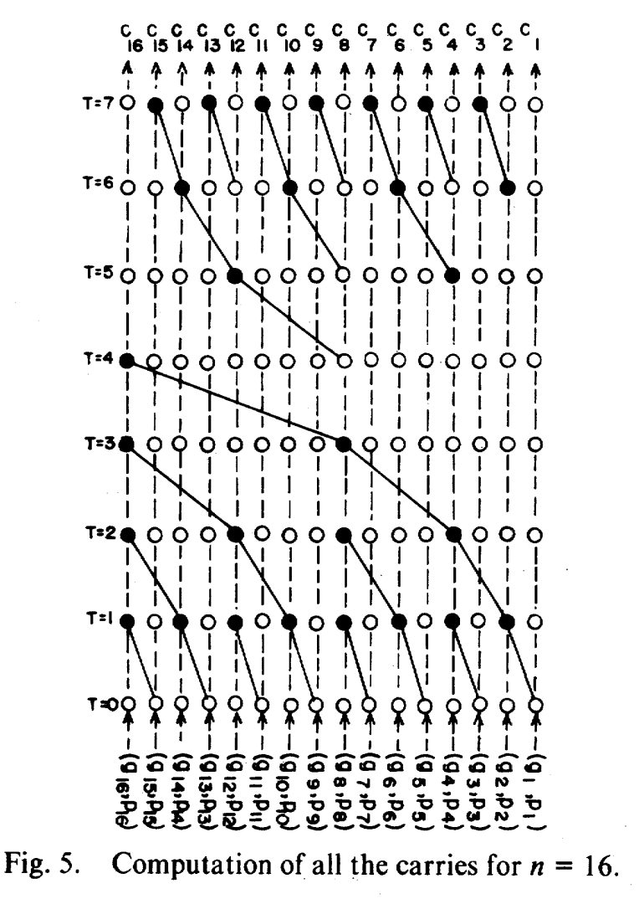


# Introduction 
The *scan* problem, also known as the *prefix sum* problem, isn't very hard to state: 

**Scan Problem**: Given an array of 
\\(N\\) integers, \\(a_1, a_2, a_3, \dots, a_N\\), find an array \\(b\\) of length \\(N\\) such that \\(b_k = \sum_{i = 1}^k a_i\\). In other words, \\(b_k\\) is the sum of the first \\(k\\) values of \\(a\\). The \\(b\\) array is referred to as the *scan array* of \\(a\\) or just the *scan array*.

It's also not difficult to write a recurrent algorithm that computes this in linear time, using the fact that \\(b_1 = a_1\\) and \\(b_i = b_{i - 1} + a_i\\): 

```C++ 
int N, a[N], b[N];
b[1] = a[1];
for(int i = 2; i <= N; i++) {
    b[i] = b[i - 1] + a[i];
}
```
The static case is not very interesting, and can be solved in linear time and space using the above snippet. 

<!-- But what happens when we allow for changes in the sequence \\(a\\)? In this article, I will explore what happens when you allow changes to the array \\(a\\) (for example, if I added \\(42\\) to \\(a_5\\) and then requeried), and use that as a stepping stone to then come up with an algorithm that is only possible under parallel conditions (i.e. when you get your hands on a shiny new GPU to play with). 
 -->
We will show that you can get \\(O(\log N)\\) update and query times in the dynamic case with linear time preprocessing using a cute data structure named [Fenwick trees](#fenwick-trees), and build upon this foundation to intuitively explain the [Brent-Kung construction](#the-brent-kung-scan), leading to an \\(O(\log N)\\) construction of the scan array \\(b\\). 

## Fenwick trees: Fast Dynamic Sequential Algorithm
### Dynamic Scans 
Let's spice things up a little bit. What if, instead of only getting the array \\(b\\) where array \\(a\\) is static, we allowed for two types of operations? Here they are:
1. `Query` \\(i\\): Find the value of \\(\sum_{j = 1}^i a_j\\)
2. `Add` \\(i~x\\): Add \\(x\\) to \\(a_i\\).  
Our for-loop solution is still correct, but it incurs an \\(O(N)\\) recalculation cost every time we ran `Add`. 
### First approach: Chunking 
Let's try chunking. We will split the array into \\(K\\) equal chunks (assuming that \\(N\\) is a factor of \\(K\\)), and for each chunk, we store the prefix sum of all numbers in this chunk. Index \\(i\\) belongs to block \\(\lfloor i/K \rfloor\\). 
More precisely, we store the sum of each chunk, and for each index, we store the sum of the elements from the start of the block the index is in to that index, that is, we store \\(\sum_{j = \lfloor i/K \rfloor \cdot K}^{i} a_j\\) for all \\(i\\).
Now, how might we use this additional information to speed up our operations? 

For our `Query` operation, say we wanted to know the prefix sum at \\(i\\), \\(\sum_{j=1}^i a_i\\). Then we get the sum of all block sums before \\(i\\), and add that to the prefix of this block at \\(i\\). The first step takes \\(O(i/K)\\) time because there are \\(i/K\\) blocks and the second takes constant time because we store the prefix sums within blocks. This operation takes \\(O(N/K)\\) time.

For our `Add` operation, we just have to update the prefix sums within the block, which is at most \\(O(K)\\) time. 

As we'd like to minimise both `Query` and `Add` operations, we'll set them equal and solve for \\(K\\), as when the runtimes for `Query` and `Add` are not equal, it is always possible to increase the running time of one to decrease the other. Hence 
$$
    K = N/K \implies K = O(\sqrt{N}),
$$
which means that we can do both `Query` and `Add` in square root time. Not bad!
Aside from being a cute approach, I feel that this is a good introduction to the concept of breaking up a prefix query
into a number of different chunks which may then be precomputed and composed. In addition, modifying one entry should not 
result in a modification of many chunks. Our chunking scheme here partitions the array into distinct, mutually-exclusive chunks,
but this need not be the case as we will see in the next section.
### Fenwick trees 
We will now introduce the Fenwick Tree data structure, also called a Binary Indexed Tree (BIT). 
> A Fenwick tree or binary indexed tree (BIT) is a data structure that can efficiently update values and calculate prefix sums in an array of values. --[Wikipedia](https://en.wikipedia.org/wiki/Fenwick_tree)

In a great example of [Stigler's law of eponymy](https://en.wikipedia.org/wiki/Stigler%27s_law_of_eponymy), which states that a lot of the time, things aren't named after the original discoverer of said thing, the Fenwick Tree was originally proposed by Boris Ryabko in 1989. 

The Fenwick tree supports the two operations above: `Query` and `Add`. Additionally, both of these operations are supported in \\(O(\log N)\\) time! This huge improvement relies on two simple facts: 

**Fact 1. For any positive integer \\(n\\), there are \\(O(\log n)\\) ones its binary representation.**

**Fact 2. Out of all the ones in the binary expansion of some positive integer \\(n\\), there is a smallest one. We will call this number \\(\mathrm{lowbit}(n)\\). For example, \\(18 = 16 + 2\\), so its \\(\mathrm{lowbit}\\) is \\(2\\).**

**Note.** It will be helpful to visualise indices in their binary representation whenever indices and lowbits are involved. For example, \\(i - \mathrm{lowbit}(i)\\) is \\(i\\) with its rightmost zero set to one. 

#### The Query operation
Now let's see how these facts can lead to significant speedups. Say we wanted to find the prefix sum of the first \\(21\\) elements. Then we could divide the whole sum thus: 
$$
\sum_{i=1}^{21}a_i=\sum_{i=1}^{16}a_i+\sum_{i=17}^{20}a_i+\sum_{i=21}^{21}a_i.
$$
What's the pattern here? The answer is that starting from \\(21\\), we always add the number of elements corresponding to the lowbit and recurse: 
- The lowbit of \\(21\\) is \\(1\\), so we take \\(1\\) number, \\(a_{21}\\), and we add that to our answer;
- The lowbit of \\(20\\) is \\(4\\), so we take \\(4\\) numbers, \\(a_{17}\\) to \\(a_{20}\\), and we add that to our answer; 
- The lowbit of \\(16\\) is \\(16\\) itself, so we take the remaining \\(16\\) numbers.

In general, to compute the prefix of the first \\(k\\) numbers, we take \\(\mathrm{lowbit}(k)\\) numbers from the end, and add that to our result. Of course, we also have to recurse to \\(k - \mathrm{lowbit}(k)\\). Thus intuitively for this to work, we have to maintain \\(\sum_{j = i  - \mathrm{lowbit}(i) + 1}^i a_j\\) for every \\(i\\) efficiently.

Fenwick trees, also called Binary Index Trees (BITs), are used to do exactly this. 
Let's maintain an array, which we'll call \\(\mathrm{BIT}\\),
defined on index \\(k\\) as the sum of elements from index \\(k - \mathrm{lowbit}(k) + 1\\) to index \\(k\\), inclusive. 
Formally, the array \\(\mathrm{BIT}\\) is defined thus: 

$$
\mathrm{BIT}_k=\sum _{i=k-\mathrm{lowbit}(k)+1}^ka_i.
$$

So assuming we can get the lowbit of any number in constant time (spoilers), we have an algorithm for `Query` in \\(O(\log N)\\) time! 
```C++
int N = ...;
int BIT[N];
int BIT_Query(int k) {
    int res = 0;
    for(; k > 0; k -= lowbit(k)) res += BIT[k];
    return res;
}
```
#### The Add operation
That's all good and well, but what about `Add`? Which entries of \\(\mathrm{BIT}\\) would we have to modify? And are there few enough of them so that we can update all of them in logarithmic time? 

Suppose we wanted to do `Add` \\(k~x\\), and we have to update index \\(j\\). The strategy is to find the smallest index that we have to update and use that information to find the next smallest, and repeat. Obviously, the smallest index that we'd have to change is \\(k\\) itself. The interesting part is using this information - we will show that \\(k' = k + \mathrm{lowbit}(k)\\) is the next smallest index that we have to change. To do this, 
we must show two things: (1) \\(k' - \mathrm{lowbit}(k') < k\\) (i.e., that we do have to change index \\(k'\\)), and (2) for all indices between \\(k\\) and \\(k'\\), we do not have to change that index. 

Let's start with (1). Writing \\(k\\) as \\(x \cdot 2^r\\) where \\(2^r = \mathrm{lowbit}(k)\\) and \\(x\\) is odd, we may also express \\(k'\\) in terms of \\(x\\) and \\(r\\) as 

$$
k' = k + \mathrm{lowbit}(k) = (x + 1) \cdot 2^r.
$$

Since \\(x\\) is odd, it follows that \\(x + 1\\) is even and hence \\(\mathrm{lowbit}(k') \ge 2^{r + 1}\\).
It follows that \\(k' - \mathrm{lowbit}(k') \le (x - 1) \cdot 2^r < k\\), confirming that we do have to update position \\(k'\\). 

Now, what about all the indices between \\(k\\) and \\(k'\\)? Suppose \\(0 < z < \mathrm{lowbit}(k)\\), and \\(k'' = k + z\\) is some index between \\(k\\) and \\(k''\\). We want to prove that we do not have to update index \\(k''\\). Equivalently, that \\(k'' - \mathrm{lowbit}(k'') > k\\). 
Since \\(z < \mathrm{lowbit}(k)\\), it follows that \\(\mathrm{lowbit}(k'') = \mathrm{lowbit}(z) \le z < \mathrm{lowbit}(k)\\). I will not prove this statement but leave it to the user to 
demonstrate to themselves that it is true - consider the binary expansions of \\(k'' = k + z\\). It thus follows that

$$
k'' - \mathrm{lowbit}(k'') > k + z - z = k.
$$

Thus \\(k''\\) will not need to be updated. This series of inequalities gives us the following
almost one-liner to update our \\(\mathrm{BIT}\\) array: 
```C++
int N = ...;
int BIT[N];
void BIT_Add(int k, int x) {
    for(; k < N; k += lowbit(k)) BIT[k] += x;
}
```
### Excursus: Fast lowbits 
It's not the point of this post to delve into the inner workings of how [two's complement](https://en.wikipedia.org/wiki/Two%27s_complement) works in storing signed integers,
but it's possible to exploit it and use bit operations to calculate \\(\mathrm{lowbit}(\cdot)\\) in constant time in C/C++: 
```C++
int lowbit(int k) {
    return k & -k;
}
```
I shall leave it as an exercise to see why the above piece of code works, but a crucial piece of information is that the negation of an integer in two's complement is represented as inverting its bits and adding one to the unsigned representation of that. 
### BIT recap 
A BIT is a data structure that supports two operations: `Query` to query the prefix sum of 
an array, and `Add` to dynamically update the value of an array entry. With \\(O(N)\\) preprocessing, 
it can achieve both tasks in \\(O(\log N)\\) time. It does so by maintaining unequal sums of chunks of the data,
and each query may be decomposed into a sum of \\(O(\log N)\\) chunks. Updating an entry also only affects \\(O(\log N)\\) chunks. 

The reader may be interested in the following generalisations of this data structure:
- How does one maintain higher-dimensional prefix sums with \\(\log\\) penalties? For example, how do I maintain grid prefixes and updates in \\(O(\log^2 N)\\) time per query/update?
- Instead of prefix sums, can one maintain other operations? Prefix products? Prefix matrix products? What about prefix min/maxes for range queries? Which operations in general can I support?
## The Brent-Kung Scan
Fenwick trees were developed in 1989. The year is now 2025, and we have shiny new GPUs to play with. Can we make our scans even faster? 
We will lay out some more rules to make our game more interesting: 
1. We will solve the static scan problem - that is, no `Add` operations, only `Query`. 
2. We will be working under an idealised parallel computing model. Though this is not the case practically, we will assume that we have 
as many cores as we need, and that warp size is infinite, etc. This ensures that we can focus on the analysis of our 
algorithm instead of having to apply other tricks to deal with pesky real-world constraints.

Note that throwing a GPU at the code in the [Introduction](#introduction) won't work, as the code is recurrent and has a 
linear data dependency: you can't compute \\(b_i\\) until you've computed \\(b_{i-1}\\). 

The [Brent-Kung algorithm](https://ieeexplore.ieee.org/abstract/document/1675982?casa_token=-kIKEZc2vFoAAAAA:KlicFhXJ_JP5smZUbBpgoQQYe5vFgmIv5fpSAbijOWYxxYzUHUEb4ox6zyLIFiBd6tH89lr6Sg) was developed in 1982 (earlier than Fenwick trees!), and was originally used as an adder in chip design.
Here, I would like to give a more intuitive understanding of how it works by understanding it as analogous to two phases of parallel BIT operations. By the end of this section, my goal is for you to be able to intuitively grasp why the Brent-Kung Scan is designed the way it is, be able to rederive it given pen and paper, and more ambitious readers may want to implement their own scan kernel in CUDA C. 

### The Brent-Kung Architecture
The following image is taken from [Brent and Kung's 1982 paper](https://ieeexplore.ieee.org/stamp/stamp.jsp?arnumber=1675982&casa_token=mQzDf0JhJa0AAAAA:tn8gGzl4F0RE9v1FarJUOcnuhoma8ceCNjsnqpLmZSMmd3L7zvG0qNACpbT0kQRh_eP705PHYw) (Figure 5) and shows the overarching architecture of the scan for \\(N = 16\\). The starting array is at the bottom, and operations are done from the bottom to the top. At the top, values \\(c_{1}\\) to \\(c_{16}\\) denote the prefix sum from right to left. Nodes coloured black denote summation. For example, at \\(T = 4\\) the value of the array at index \\(8\\) is added to index \\(16\\). 


Notably, connected black lines represent data dependencies. There are two chains of length \\(O(\log N)\\), and so we expect the number of iterations to be roughly \\(T = O(\log N)\\). So this approach is efficient, but we have not yet answered the question of *why* this works.
### Parallel Fenwick Operations 
Referring back to the figure, we see that there are two phases in their algorithm: the first phase from \\(T = 0\\) to \\(T = 4\\), characterised by a tree that has its leaves pointing downwards, and the second phase from \\(T = 4\\) to \\(T = 8\\), with its leaves pointing upwards. There is in fact an intuitive way to understand these two phases: the first phase are parallel `Add` operations, and we end up with the \\(\mathrm{BIT}\\) array after it; the second phase are parallel `Query` operations, akin to running `Query` on each index in parallel. This is an elegant solution that does not involve auxiliary arrays and is able to cleverly modify everything in place so that we end up with the desired result. 

> the first phase are parallel `Add` operations, and we end up with the \\(\mathrm{BIT}\\) array after it; the second phase are parallel `Query` operations, akin to running `Query` on each index in parallel.
### Phase 1: Parallel Adds
One may construct the \\(\mathrm{BIT}\\) array of \\(a\\) given the operations `Add` and `Query` by repeatedly calling `Add` \\(i~a_i\\), which would normally take \\(O(N \log N)\\) time. We assume that we will be working with an array \\(c\\) of length \\(N\\) that already has the values of \\(a\\) stored within them (it's trivial to copy over these values in constant time in parallel). 

Instead, we would like to maintain the following invariant: 

**Phase 1 Invariant.** On iteration \\(T\\), the array at index \\(i\\) stores either the sum of elements from \\(i - \mathrm{lowbit}(i) + 1\\) to \\(i\\) or \\(i - 2^T + 1\\) to \\(i\\), whichever is shortest. 

In other words, the array on iteration \\(T\\) is a sort of "truncated" \\(\mathrm{BIT}\\) array, with no sums having more than \\(2^T\\) elements. It's easy to verify that the invariant holds for \\(T = 0\\) (array \\(a\\) itself), and that if we were able to maintain this invariant, we would only need \\(T = O(\log N)\\) iterations to compute the full \\(\mathrm{BIT}\\) array.

> the array on iteration \\(T\\) is a sort of "truncated" \\(\mathrm{BIT}\\) array, with no sums having more than \\(2^T\\) elements.
 
Maintaining this invariant is actually not super difficult: suppose that we are at some iteration \\(t > 0\\). Then all the elements \\(i\\) that have to be updated are the ones whose lowbit is greater or equal to \\(2^t\\). That is, all multiples of \\(2^t\\). Suppose index \\(i = x \cdot 2^t\\). Currently, \\(c_i\\) stores the sum of \\(2^{t - 1}\\) values: \\(\sum_{j = i - 2^{t - 1} + 1}^i a_j\\), and \\(c_{i - 2^{t - 1}}\\) also stores the sum of \\(2^{t - 1}\\) values, \\(\sum_{j = i - 2^t}^{i - 2^{t - 1}} a_j\\). Hence we just need to combine the two to get our desired result! Note that there aren't data depenedency issues because \\(i - 2^{t - 1}\\) has a lowbit of \\(2^{t - 1}\\) and thus does not need to be updated.

Thus at iteration \\(i\\), we update every \\(c_i\\) with the rule \\(c_i \gets c_i + c_{i - 2^{t - 1}}\\) for all \\(i = x \cdot 2^t\\) all at once. The reader may check that this is consistent with the bottom tree in the above figure. 
### Phase 2: Parallel Queries
In the sequential case, to get the prefix sum at an index we use the `Query` operation. If we wanted *all* prefix sums (as in our scan case), then we'd have to call `Query` \\(O(N)\\) times, leading again to a call time of \\(O( N\log N)\\). Recall that \\(c_i\\) stores the sum of all values from \\(i - \mathrm{lowbit}(i) + 1\\) to \\(i\\). Hence when we update \\(c_i\\), we would like \\(c_{i - \mathrm{lowbit}(i)}\\) to store the prefix sum all the way up to \\(i - \mathrm{lowbit}(i)\\) so that \\(c_i\\) can store the prefix sum up to \\(i\\). Formally, we would like \\(c_{i - \mathrm{lowbit}(i)} = \sum_{j = 1}^{i - \mathrm{lowbit}(i)} a_j\\) so that

$$
c_{i - \mathrm{lowbit}(i)}  + c_i = \sum_{j = 1}^{i - \mathrm{lowbit}(i)} a_j + \sum_{j = i - \mathrm{lowbit}(i) + 1}^i a_j = \sum_{j = 1}^i a_j.
$$


To do this, we again maintain another invariant, this time going from indices with large to small lowbits: 

**Phase 2 Invariant.** In iteration \\(T\\) of phase 2, all \\(c_i\\) with \\(\mathrm{lowbit}(i) \ge N / 2^{T}\\) stores \\(\sum_{j = 1}^{i} a_i\\).

Again, it should be fairly obvious that initially the invariant holds (at \\(T = 0\\), we only need \\(c_N = \sum_{j = 1}^{N} a_j\\), which is true if we assume \\(N\\) to be a power of \\(2\\)) and if we can maintain this invariant we only need \\(T = O(\log N)\\) iterations to recover the scan array.

On iteration \\(t\\), only those indices \\(i\\) with \\(\mathrm{lowbit}(i) = 2^t\\) need to be updated. We may update them with the rule \\(c_i \gets c_i + c_{i - \mathrm{lowbit}(i)}\\). Note that \\(i - \mathrm{lowbit}(i)\\) must have a larger lowbit than \\(i\\) or is zero, and so must be already a prefix sum due to our invariant - this also shows that there are no data dependency issues. Hence we only need \\(O(\log N)\\) parallel iterations to recover the scan array from the \\(\mathrm{BIT}\\) array at the end of Phase 1. One may verify that the indices of black dots in the above figure in Phase 2 at each time step are indeed the ones with the same lowbit. 


## TL;DR 
- The [Scan](#introduction) problem is the problem of finding the prefix sum of an array given some starting list of values. 
- The [Fenwick tree](#fenwick-trees) data structure offers \\(O(\log N)\\) operations in the serial case and allows for updates. 
- Under a parallel model, the [Brent-Kung Scan](#the-brent-kung-scan) construction allows for \\(O(\log N)\\) computation of the scan array. 
- The Brent-Kung construction may be understood as applying two phases of parallel Fenwick operations. 

## Conclusion 
As far as I know, this article is the first to point out the connection between Fenwick trees and Brent-Kung scans in their use of the \\(\mathrm{BIT}\\) and clever use of lowbits. When I learned about the Brent-Kung scan (and its sibling the [Kogge-Stone scan](https://ieeexplore.ieee.org/document/5009159)), no rationale was given for its design and this article was borne of hours of frustration with trying to understand the why of its design until I saw this neat connection. 

## References & Resources

1. Brent, and Kung. "A regular layout for parallel adders." *IEEE transactions on Computers* 100.3 (1982): 260-264.
2. Kogge, Peter M., and Harold S. Stone. "A parallel algorithm for the efficient solution of a general class of recurrence equations." *IEEE transactions on computers* 100.8 (1973): 786-793.
3. Fenwick, Peter M. "A new data structure for cumulative frequency tables." *Software: Practice and experience* 24.3 (1994): 327-336.
4. Kirk, David B., and W. Hwu Wen-Mei. Programming massively parallel processors: a hands-on approach. Morgan kaufmann, 2016.
5. [Algorithms for Competitive Programming - Fenwick Tree](https://cp-algorithms.com/data_structures/fenwick.html)
6. [UIUC ECE408 Applied Parallel Programming, Lecture 16: Parallel Computation Patterns - Parallel Scan](https://lumetta.web.engr.illinois.edu/408-S20/slide-copies/ece408-lecture16-S20.pdf)
